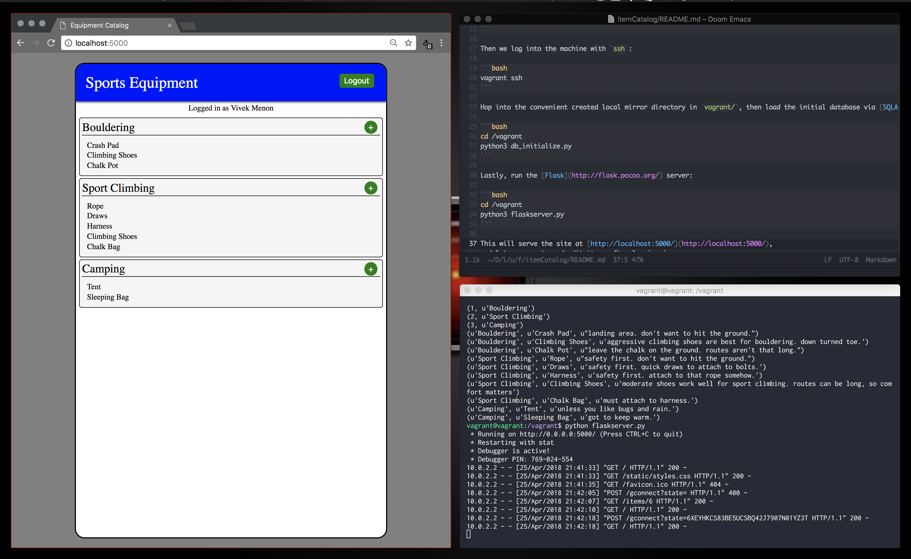

# itemCatalog
An item catalog project for the [Udacity Full Stack
Nanodegree](https://classroom.udacity.com/nanodegrees/nd004/) using [Flask](http://flask.pocoo.org/), and [SQLAlchemy](http://www.sqlalchemy.org/).



### Building 

First, we spin up a [Vagrant](https://www.vagrantup.com/downloads.html) virtual
machine using [VirtualBox](https://www.virtualbox.org/wiki/Downloads), typically
running [Ubuntu](https://app.vagrantup.com/bento/boxes/ubuntu-16.04):

```bash
vagrant ssh
```

Then we log into the machine with `ssh`:

```bash
vagrant ssh
```

Hop into the convenient created local mirror directory in `vagrant/`, then load the initial database via [SQLAlchemy](http://www.sqlalchemy.org/):

```bash
cd /vagrant
python3 db_initialize.py
```

Lastly, run the [Flask](http://flask.pocoo.org/) server:

```bash
cd /vagrant
python3 flaskserver.py
```

This will serve the site at [http://localhost:5000/](http://localhost:5000/),
and let you create and edit items after logging in
([Google+](https://plus.google.com/discover) was the easiest, lol.)!
